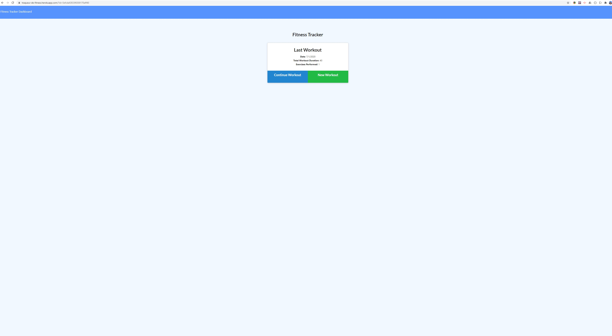
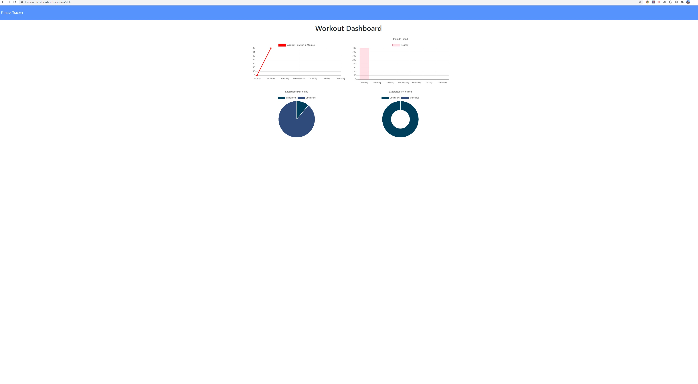

# Fitness Workout Tracker

This is a small web app that allows the user to create and edit workouts. They can then view works outs on a seperate dashboard.

## Table of Contents

- [User Story](#User%20Story)
- [Acceptance Criteria](#Acceptance%20Driteria)
- [Build Status](#Build%20Status)
- [Technology](#Code%20Style%20and%20Technology)
- [Use](#Usage)
- [Download](#Download)
- [Credits](#Credits)
- [Notes](#Notes)
- [Screenshots](#Screenshots)

## User Story

- As a user, I want to be able to view create and track daily workouts. I want to be able to log multiple exercises in a workout on a given day. I should also be able to track the name, type, weight, sets, reps, and duration of exercise. If the exercise is a cardio exercise, I should be able to track my distance traveled.

## Acceptance Criteria

When the user loads the page, they should be given the option to create a new workout, or continue with their last workout.

The user should be able to:

- Add exercises to a previous workout plan.
- Add new exercises to a new workout plan.
- View multiple the combined weight of multiple exercises on the `stats` page.

## Build Status

Complete and tested as working.

## Technology

Built using:
HTML, CSS, Node, Express, Mongoose, Mongo, Morgan

## Usage

To use this application visit:\
https://traqueur-de-fitness.herokuapp.com/

## Download

The source code can be downloaded here:
https://github.com/SaundersEddie/fitness-tracker

## Credits

Basic Framework Trilogy
Functionality creation and testing Eddie Saunders

https://github.com/SaundersEddie

## Notes

This build experienced many issues throughout, from me pushing the wrong version code up, to git no longer believing the repository was available...

## Screenshots

